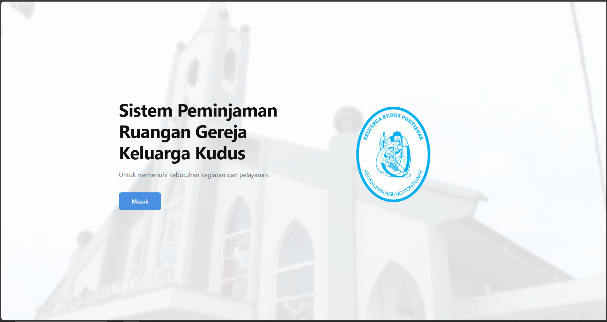
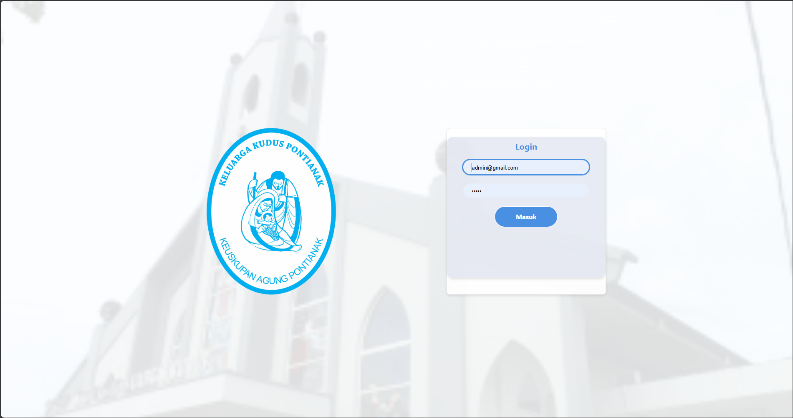
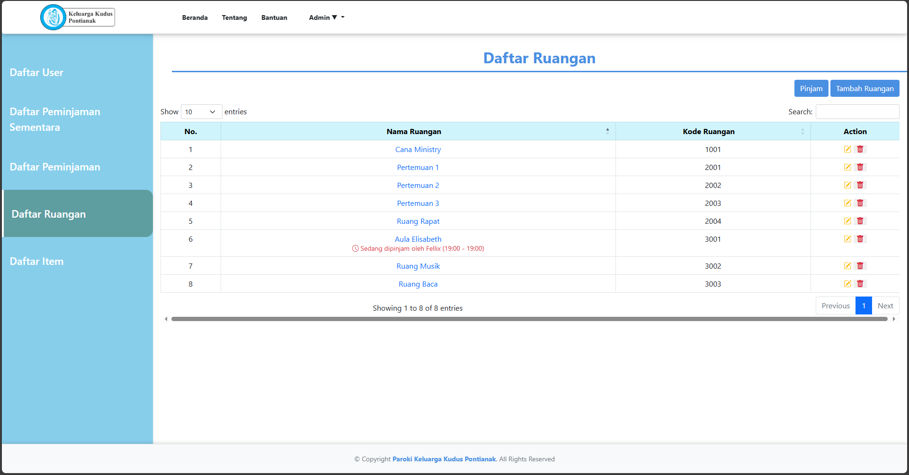
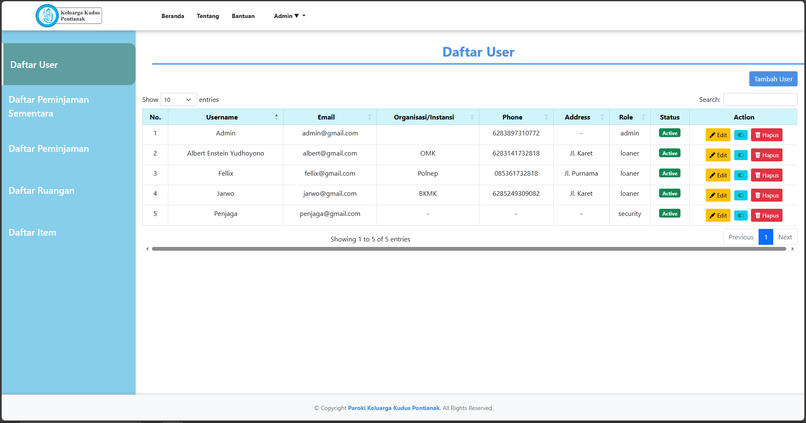
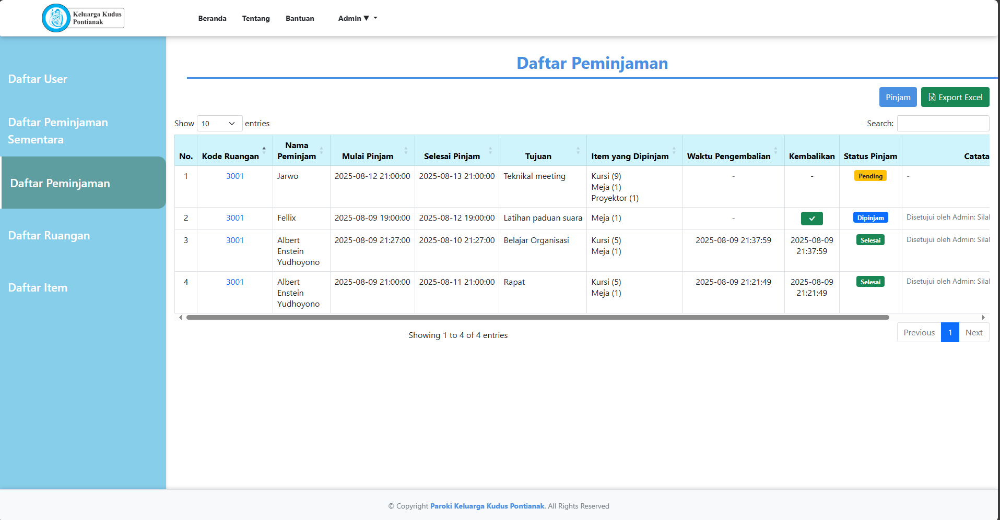
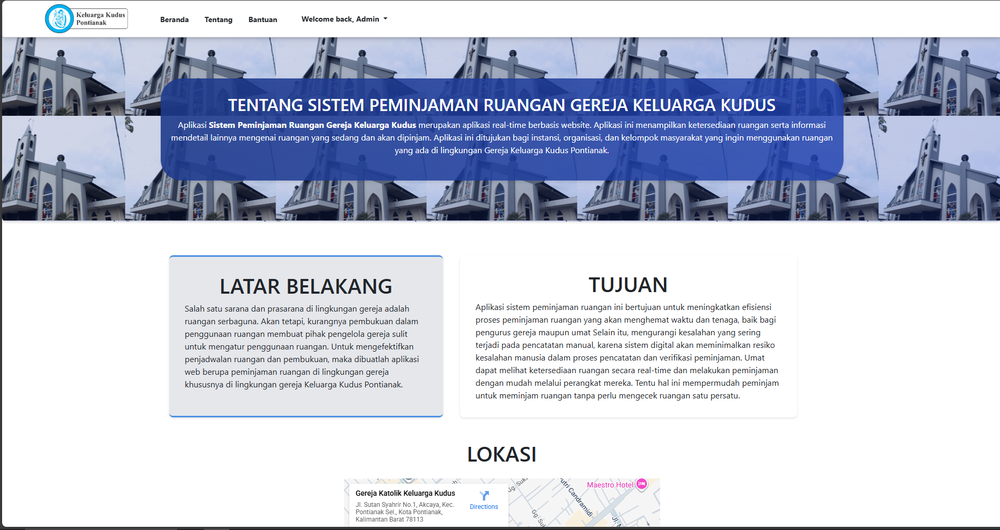
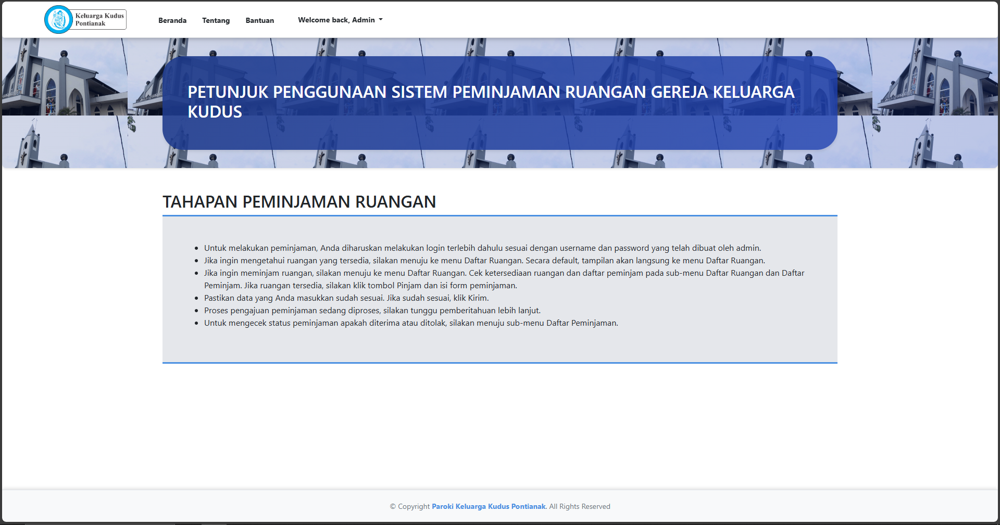

## 1. Judul & Deskripsi

RentRoom – Aplikasi Peminjaman Ruangan Gereja Berbasis Web

Aplikasi web untuk mengelola data ruangan, peminjam, jadwal peminjaman, serta denda keterlambatan apabila peminjaman melewati batas waktu yang ditentukan di Gereja Katolik Keluarga Kudus (misalnya aula, ruang pertemuan, ruang rapat, dan fasilitas gereja lainnya).

---

## 2. Deskripsi Ringkas Fungsi dan Tujuan

Aplikasi ini membantu pengelola/paroki Gereja Katolik Keluarga Kudus dalam:

- Mencatat dan mengelola data ruangan (status terpakai/kosong, kapasitas, fasilitas)
- Mengelola data peminjam (komunitas/lingkungan/umat, kontak, riwayat peminjaman)
- Mengelola pemesanan/jadwal pemakaian ruangan
- Mendeteksi peminjaman yang terlambat kembali dan menghitung denda keterlambatan
- Menyajikan laporan dan statistik peminjaman ruangan serta denda keterlambatan untuk pengambilan keputusan

### Fitur Utama

- Data Ruangan: tambah, ubah, hapus, kategori/tipe ruangan, status okupansi
- Data Peminjam: tambah, ubah, hapus, riwayat peminjaman, status aktif/non-aktif
- Transaksi Peminjaman: pemesanan, penjadwalan, pembatalan/pengubahan jadwal
- Denda Keterlambatan: penandaan peminjaman yang terlambat, perhitungan denda sesuai aturan yang ditetapkan
- Laporan: laporan penggunaan ruangan, rekap peminjaman per periode, dan rekap denda keterlambatan
- Dashboard: ringkasan metrik (ruangan tersedia, ruangan terpakai, peminjam aktif, total denda keterlambatan)

---

## 3. Teknologi yang Digunakan

- Framework Backend: Laravel 9 (PHP 8.x)
- Frontend: Blade + (Bootstrap / CSS kustom)
- Database: MySQL/MariaDB
- Tooling: Laravel Mix, Node.js & npm

---

## 4. Instalasi & Konfigurasi

1) Siapkan lingkungan

- Gunakan Laragon (disarankan) atau stack serupa (Apache + MySQL + PHP).
- Pastikan PHP 8.x, Composer, Node.js & npm sudah terpasang.

2) Ambil kode sumber

- Letakkan proyek di:
  - `d:\Aplikasi\laragon\www\rentroom`
  - (atau folder `www`/`htdocs` lain sesuai konfigurasi server lokal Anda)

3) Pasang dependensi

- Jalankan perintah berikut di root proyek:
  - `composer install`
  - `npm install`

4) Konfigurasi `.env`

- Salin contoh:
  - Windows: `copy .env.example .env`
- Generate key:
  - `php artisan key:generate`
- Atur koneksi database (contoh):
  - `DB_CONNECTION=mysql`
  - `DB_HOST=127.0.0.1`
  - `DB_PORT=3306`
  - `DB_DATABASE=rentroom`
  - `DB_USERNAME=root`
  - `DB_PASSWORD=` (kosong bila default Laragon/XAMPP)
- Buat database dengan nama yang sama di phpMyAdmin atau tool database lain.

5) Migrasi & (opsional) seeder

- Migrasi:
  - `php artisan migrate`
- Seeder (jika tersedia):
  - `php artisan db:seed`

6) Menjalankan aplikasi

- Via Laravel built-in server:
  - `php artisan serve`
  - Akses `http://127.0.0.1:8000`
- Atau via Laragon:
  - Akses domain yang dibuat otomatis oleh Laragon (mis. `http://rentroom.test`) yang mengarah ke folder `public/`.

7) Asset front-end

- Mode pengembangan:
  - `npm run dev` atau `npm run watch`
- Build produksi:
  - `npm run prod`

Catatan: Jika perubahan tidak muncul, coba:

- `php artisan config:clear`
- `php artisan route:clear`
- `php artisan view:clear`

---

## 5. Tata Cara Penggunaan Aplikasi

1) Login

- Buka aplikasi pada browser (`http://127.0.0.1:8000` atau domain Laragon).
- Masukkan email dan kata sandi lalu klik tombol **Masuk**.
- Jika gagal, pastikan kredensial benar atau hubungi admin untuk reset.

2) Mengenal Dashboard

- Lihat kartu ringkasan:
  - Total Ruangan
  - Ruangan Terpakai
  - Ruangan Tersedia
  - Total Peminjam Aktif
  - Total Denda Keterlambatan (periode tertentu, bila tersedia)
- Grafik/diagram membantu memantau tren penggunaan ruangan dan denda keterlambatan.
- Gunakan menu sisi kiri/atas untuk menuju modul:
  - Data Master, Transaksi, Laporan, Pengaturan, dll. (tergantung implementasi).

3) Mengelola Data Ruangan

- Navigasi: **Data Master** > **Data Ruangan** > klik tombol **Tambah Ruangan**.
- Isi data wajib:
  - Nama/nomor ruangan
  - Tipe/kategori ruangan (aula, ruang rapat, ruang pertemuan, dll.)
  - Kapasitas
  - Fasilitas utama
  - Status awal (tersedia/terpakai)
- Simpan. Ruangan akan tampil di tabel dengan status ter-update.
- Gunakan fitur ubah/hapus untuk mengelola data ruangan yang sudah ada.

4) Mengelola Data Peminjam

- Navigasi: **Data Master** > **Data Peminjam** > klik **Tambah Peminjam**.
- Isi data:
  - Nama komunitas/lingkungan/umat
  - Penanggung jawab (PIC)
  - Nomor telepon
  - Alamat/keterangan tambahan
- Simpan. Peminjam akan muncul di daftar dengan status **Aktif**.

5) Membuat Pemesanan / Jadwal Peminjaman

- Navigasi: **Transaksi** > **Pemesanan / Peminjaman Ruangan** > klik **Tambah Transaksi**.
- Pilih peminjam dan ruangan:
  - Sistem dapat memvalidasi apakah ruangan masih tersedia pada tanggal/jam yang dipilih.
- Atur tanggal dan jam mulai serta selesai pemakaian.
- Simpan. Status ruangan pada jadwal tersebut menjadi **Terpakai** (atau sesuai konfigurasi).

6) Mengelola Perubahan / Pembatalan Jadwal

- Navigasi: **Transaksi** > **Jadwal Peminjaman**.
- Cari transaksi aktif berdasarkan peminjam atau ruangan.
- Buka detail, lalu:
  - Ubah jadwal (tanggal/jam) bila perlu.
  - Atau batalkan peminjaman jika kegiatan tidak jadi dilaksanakan.

7) Pengelolaan Keterlambatan & Denda

- Navigasi: **Transaksi** > **Pengembalian / Selesai Peminjaman** (atau menu sejenis).
- Cari peminjaman yang sudah lewat dari batas waktu yang ditentukan.
- Saat menandai peminjaman sebagai selesai/dikembalikan:
  - Sistem dapat menghitung denda keterlambatan berdasarkan aturan (misalnya jumlah hari/jam terlambat dikali tarif denda).
  - Pembayaran denda dilakukan **secara langsung** oleh peminjam kepada petugas (security atau admin) pada saat pengembalian ruangan.
  - Setelah denda dibayarkan, petugas mencatat status peminjaman sebagai **Selesai** dan denda sebagai **Lunas** di sistem.

8) Laporan Peminjaman Ruangan dan Denda

- Navigasi: **Laporan**.
- Pilih jenis laporan, misalnya:
  - Laporan penggunaan ruangan
  - Rekap peminjaman per ruangan/peminjam
  - Rekap denda keterlambatan per periode
- Tentukan rentang tanggal/periode dan filter tambahan.
- Klik **Tampilkan** untuk melihat laporan.
- Gunakan tombol **Cetak** untuk simpan sebagai PDF atau cetak langsung.

9) Pencarian & Filter Cepat

- Gunakan kolom **Cari...** di atas/kanan tabel untuk mencari berdasarkan nama ruangan, peminjam, atau kode transaksi.
- Gunakan panel filter (status ruangan, periode peminjaman, tipe ruangan, dll.) lalu klik **Filter** untuk menyaring data.

10) Tips Operasional

- Pastikan status ruangan dan jadwal selalu diperbarui setelah ada perubahan peminjaman.
- Lakukan backup database secara berkala untuk menghindari kehilangan data.
- Batasi akses menu tertentu hanya untuk admin/petugas gereja melalui pengaturan role/hak akses (jika fitur tersedia).

---

## 6. Screenshots

### Landing

### Login

### Data Ruangan

### Data Peminjam

### Daftar Peminjaman Ruangan

### Tentang Gereja

### Bantuan

---

## 7. Lisensi

  

**Private License**  

Copyright (c) 2025 ensteinyudhoyono  

Project ini adalah perangkat lunak yang bersifat **private**.  
Hanya boleh digunakan untuk kepentingan internal dan/atau penelitian/pengembangan yang telah mendapatkan izin dari pemilik/pengembang.  

Dilarang keras untuk:

- Menyalin  
- Mendistribusikan  
- Memodifikasi  
- Menggunakan ulang project ini  

tanpa izin tertulis dari pemilik/pengembang.

---

## Authors

- **ensteinyudhoyono** – [GitHub Profile](https://github.com/ensteinyudhoyono)
